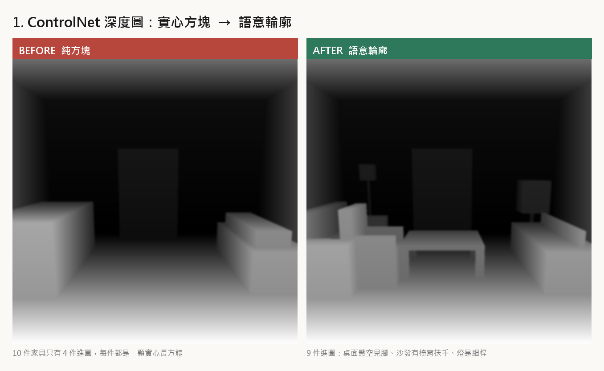
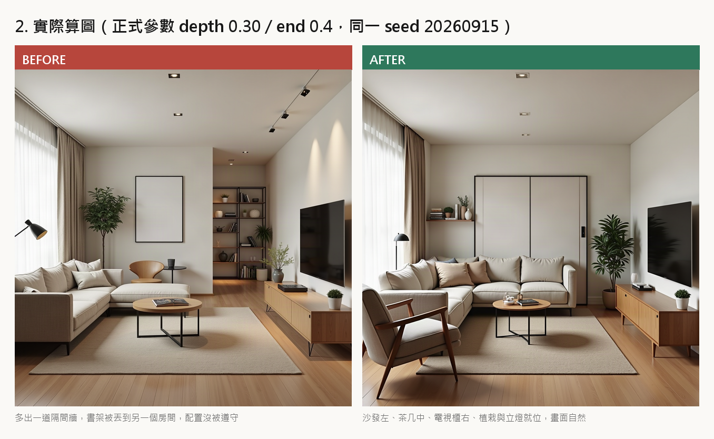
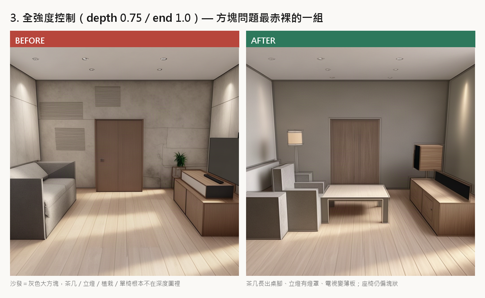

# 「算出來是一堆方塊、畫面不自然」— 問題分析與修正

> 對應程式：`designbridge/layout/scene_graph_to_depth.py`、`designbridge/layout/layout_agent.py`、
> `designbridge/core/nodes/renderer.py`
> 驗證：`test/test_semantic_depth_shapes.py`（7 項，全數通過）
> 重現腳本與原圖：`artifacts/accuracy_demo/boxy/`

---

## 1. 症狀

Step 2 用 2D 平面配置投影出深度圖、再餵給 FLUX depth-ControlNet 算圖之後，
成圖常常出現：

- 沙發變成一顆灰色大方塊，看得出位置但看不出是沙發；
- 茶几、立燈、植栽、單椅**整件消失**，畫面中央空一大塊；
- prompt 明明寫了「沙發在左邊」，成圖卻把沙發畫在別處，或憑空生出一道隔間牆。

先前的緩解手段是**把深度控制力道調弱**（`FAL_DEPTH_CONDITIONING_SCALE=0.30`、
`FAL_DEPTH_CONTROL_END=0.4`，見 `core/config.py:143`、`:154` 的註解）。
畫面是自然了，但配置也跟著不被遵守——等於用「不聽話」換「好看」。

---

## 2. 根因

### 2.1 深度圖裡真的只有方塊

`project_scene_graph_to_depth()` 把每一件家具都當成一個 footprint 往上擠出的
**實心長方體**（舊版 `_add_box` 寫死 `z0 = 0.0`）。

深度 ControlNet 是灰階輸入，它唯一能讀到的資訊就是**輪廓與距離**。
給它一顆長方體，它就只能在那個位置畫一顆長方體——模型沒有做錯，是我們給錯了。

### 2.2 一半以上的家具根本沒進深度圖

`layout_agent.py` 舊版有一份白名單 `_DEPTH_ANCHOR_TYPES`，只讓
sofa / bed / dining_table / tv_unit / wardrobe / desk / bookshelf 這幾種大件貼牆家具投影，
理由是「小件擠成方塊只是地板上的雜訊」。這個理由在 2.1 的前提下成立，
但代價是茶几、立燈、植栽、單椅、邊桌全被丟掉。

而且比對用的是 `i.type` 原字串。LLM 規劃出來的是 `platform_bed`、`floor_lamp`
這類自由文字標籤，永遠對不上白名單的短鍵，**連該留的也被誤刪**。

本次示範的 10 件家具，舊規則只有 **4 件**進得了深度圖。

### 2.3 prompt 的「左邊」和深度圖的「左邊」不是同一個左邊

`_furniture_to_spatial_text()` 直接讀平面圖正規化座標，產出
「a fabric upholstered sofa **on the left side, middle of the room**」。

但深度圖是**透視投影**後的畫面。平面圖上的 x=0.06 經過相機投影未必落在畫面左側，
貼牆的家具甚至會整件掉出 FOV。這時 prompt 仍然要求模型「在左邊畫一張沙發」，
而深度圖那裡是一片空白——模型只好自由發揮，於是生出隔間牆、把書架塞到另一個房間。

---

## 3. 修正

### 3.1 語意化家具輪廓（`furniture_parts`）

`scene_graph_to_depth.py:184` 新增 `furniture_parts()`，把一件家具拆成數個子塊
`(u0,u1,v0,v1,z0,z1)`；`_add_box` 加上 `z0` 參數（`:446`），子塊才能**懸空**。

| 類別 | 對應型別 | 拆法 |
|---|---|---|
| `seat` | sofa / loveseat / armchair / chair / stool / bench | 座墊 + 椅背 + 兩側扶手 |
| `bed` | bed / bunk_bed / crib / daybed | 床墊 + 床頭板 |
| `table` | table / desk / coffee_table / nightstand / console | **懸空桌面 + 四支細腳** |
| `panel` | tv / monitor / screen | 靠牆側一片薄板，底下留空 |
| `lamp` | lamp / floor_lamp / table_lamp | 底座 + 細燈桿 + 燈罩 |
| `plant` | plant / potted_plant / tree | 盆 + 主幹 + 樹冠 |
| `box` | 衣櫃、櫃體、未知型別 | 維持實心長方體（本來就是方塊，這是正確的） |

其中「桌面下方露出地板深度」是最強的訊號：模型**沒辦法**把一個中間有洞的輪廓畫成實心方塊。

椅背／床頭板靠哪一側由 `_back_edge()`（`:175`）決定——取 footprint 離牆最近的那條邊，
所以沙發背自動朝牆、床頭自動靠牆，不需要額外的 rotation 資訊。

型別比對走 `normalize_furniture_type()`，`platform_bed` → `bed`、`floor_lamp` → `lamp`，
自由文字標籤也能對到正確輪廓。

兩條投影路徑（合成相機 `project_scene_graph_to_depth`、照片錨定
`project_layout_onto_photo`，`:633`）共用同一份形狀知識，各自映射回自己的座標系。
同一件家具的所有子塊共用一個 `obj_id`，segmentation 上仍是單一實例。

以 `DESIGNBRIDGE_ENABLE_SEMANTIC_SHAPES=false` 可一鍵退回舊行為（`config.py:169`）。

### 3.2 白名單改成黑名單

`layout_agent.py:125`：

```python
# 舊：_DEPTH_ANCHOR_TYPES —— 只有大件貼牆家具能進深度圖
_DEPTH_SKIP_TYPES = {"rug", "carpet", "mat", "doormat"}
```

語意輪廓拿掉了「小件只是雜訊」的前提——茶几現在投影成懸空桌面加四支腳，
那是有用的訊號。只有真正的**平面地材**留在外面：2 公分高不帶任何深度資訊，
畫出來只是地上一圈游離的矩形外框。

比對同樣改走 `normalize_furniture_type()`（`:1778`），修掉 2.2 的誤刪。

### 3.3 把「投影後的實際落點」帶給 prompt

`_instance_summary()`（`scene_graph_to_depth.py:469`）掃 id buffer，
算出每件家具在**投影影像**上真正佔到的 bbox，正規化後寫進 meta：

```json
{ "type": "sofa", "visible": true,
  "x0": 0.0, "x1": 0.2871, "y0": 0.502, "y1": 0.8428,
  "cx": 0.0895, "cy": 0.6851, "area": 0.05354 }
```

`_write_projection_meta()`（`layout_agent.py:1682`）把它存成深度圖旁的
`<task_id>_projection.json`；renderer 端 `_projection_instances()`
（`renderer.py:166`）讀回來，`_instances_to_spatial_text()`（`:180`）改用**畫面座標**描述：

```
BEFORE  a fabric upholstered sofa on the left side, middle of the room, against the left wall; ...
AFTER   a fabric upholstered sofa on the left of the frame, in the foreground; ...
```

投影後不在畫面內的家具（`visible: false`）直接**從 prompt 拿掉**，
不再叫模型在一片空白處生一件深度圖沒有的家具。
排序由近到遠（畫面下方＝近），與深度圖的層次一致。

### 3.4 順手修掉的三個相鄰問題

| 位置 | 問題 |
|---|---|
| `layout_agent.py:1799` `reproject_scene_graph` | 呼叫 `_generate_floor_plan` / `_generate_projected_depth` 時參數名對不上、房間尺寸硬寫 4×4，導致重新投影的長寬比與使用者原本看到的預覽不符、家具整體偏移。改為沿用 `scene_graph` 的 `room_w`/`room_d` |
| `render/text2room.py:286` | GLB 匯出沒有保護，少一個 trimesh 就讓整個 360° 全景生成失敗（呼叫端根本只讀 panorama）。改為非致命 |
| `requirements.txt` | 補上實際有 import 但沒宣告的 `scipy`、`pydantic`、`trimesh` |

---

## 4. 前後對比

同一份 10 件家具的客廳配置、同一個相機、同一段風格 prompt、**同一個 seed（20260915）**，
唯一的差別是深度圖與它對應的空間描述句。

### 4.1 ControlNet 深度圖



| | BEFORE | AFTER |
|---|---|---|
| 進入深度圖的家具 | 4 / 10 | 9 / 10（只排除地毯） |
| 沙發 | 實心長方體 | 座墊 + 椅背 + 扶手 |
| 茶几 | 不在圖中 | 懸空桌面 + 四腳，桌下是地板深度 |
| 立燈 | 不在圖中 | 細桿 + 燈罩 |
| 電視 | 實心方塊（看起來像櫃子） | 薄板，底下留空 |

### 4.2 實際算圖（正式參數 depth 0.30 / end 0.4）



- **BEFORE**：多出一道不存在的隔間牆，書架被畫到另一個房間去，配置沒有被遵守。
- **AFTER**：沙發在左、茶几置中、電視櫃在右、植栽與立燈都就位，畫面自然。

### 4.3 全強度控制（depth 0.75 / end 1.0）

這組把控制力道拉回舊的全強度，方塊問題最赤裸：



- **BEFORE**：沙發就是一顆灰色大方塊；茶几、立燈、植栽、單椅因為不在深度圖裡，
  畫面中央整片空白。
- **AFTER**：茶几長出桌腳、立燈有燈罩、電視變成薄板、書架回到後牆。

**誠實的但書**：AFTER 這一組的座椅仍然偏塊狀。語意輪廓**減輕**但沒有消除全強度控制下的
生硬感——子塊本身還是方的。正式參數之所以維持在 0.30 / end 0.4，是因為
「語意輪廓 + 早收的弱控制」兩者相加才有 4.2 的結果；語意輪廓的價值在於
**同樣的弱控制下，配置終於被遵守了**，而不是讓全強度控制變得可用。

---

## 5. 驗證

`test/test_semantic_depth_shapes.py` — 不看像素長相，只斷言「這塊深度在說什麼」：

| 測試 | 斷言 |
|---|---|
| `test_shape_kinds_survive_free_text_labels` | 13 個自由文字標籤（`platform_bed`、`floor_lamp`…）都對到正確輪廓 |
| `test_table_top_floats_above_the_floor` | 桌面 `z0 > 0`，四支腳各自 ≤ 20% footprint |
| `test_seat_has_a_backrest_taller_than_the_cushion` | 恰好一塊落地座墊，且有部件高過它 |
| `test_table_projects_thinner_than_a_cabinet_of_the_same_footprint` | 同 footprint 同高度，桌子佔的像素 < 櫃子的 80% |
| `test_lamp_is_slender` | 燈看得見，但明顯比同尺寸實心柱體細 |
| `test_every_piece_reports_where_it_landed_on_screen` | 平面圖的左右順序，投影後在畫面上仍是左右順序 |
| `test_offscreen_piece_is_reported_not_silently_dropped` | 出框的家具回報 `visible: false`，不是靜默消失 |

```
PYTHONPATH=. python test/test_semantic_depth_shapes.py
# [silhouette] table 28730px < cabinet 71951px (same footprint)
# [lamp] 8805px vs solid column 20110px
# ALL SEMANTIC-DEPTH CHECKS PASSED
```

---

## 6. 可調參數

```
DESIGNBRIDGE_ENABLE_SEMANTIC_SHAPES     = true   # false 退回舊的實心方塊
DESIGNBRIDGE_FAL_DEPTH_CONDITIONING_SCALE = 0.30 # 深度控制力道
DESIGNBRIDGE_FAL_DEPTH_CONTROL_END        = 0.4  # 控制在去噪 40% 處收手
```
